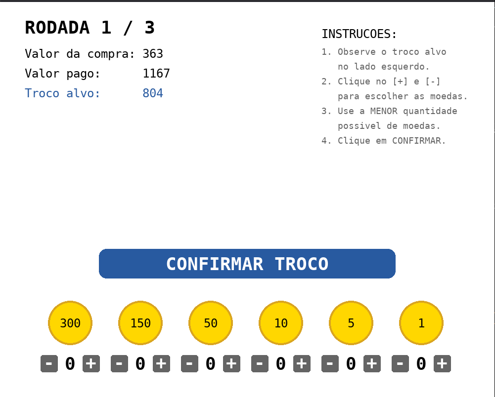
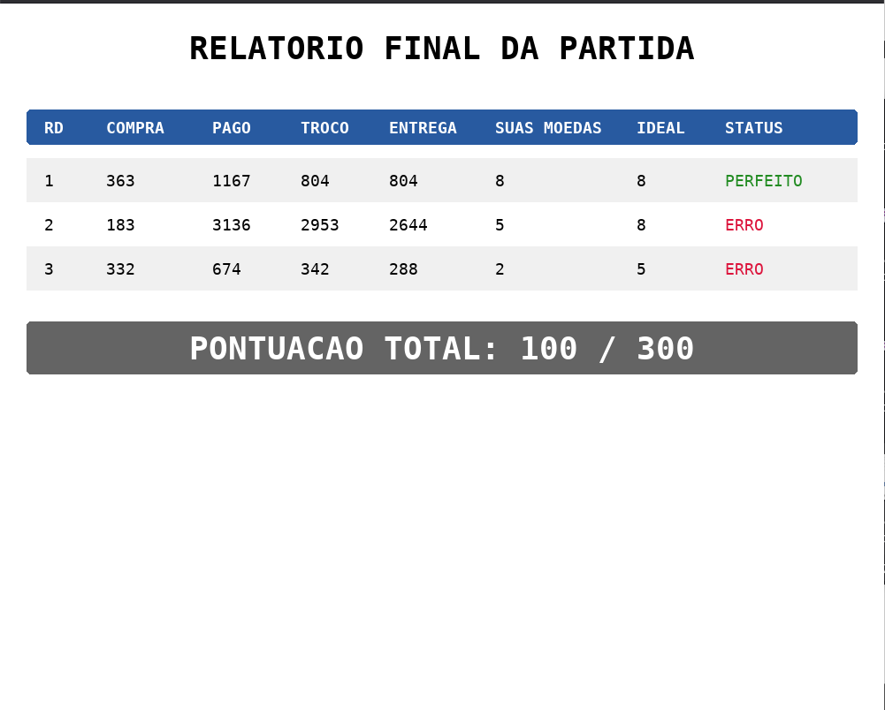

# Jogo do Troco

**Número da Lista**: 62  
**Conteúdo da Disciplina**: Algoritmos Ambiciosos (Greedy)

## Alunos

| Matrícula | Aluno | 
| ----- | ----- | 
| 231011810 | Rodrigo Ferreira do Amaral | 

## Sobre

O **Jogo do Troco** é um *puzzle* interativo focado em otimização, construído para demonstrar o funcionamento do **Algoritmo Ambicioso (Guloso)** na prática.

O jogador atua como um caixa de loja que precisa entregar o troco de uma compra. Em vez de simplesmente devolver o valor correto, o objetivo principal é entregar o troco com a **menor quantidade de moedas possível**.

* O sistema de moedas é gerado proceduralmente a cada rodada. O código garante que o conjunto seja sempre um **sistema canônico** (onde cada moeda é um múltiplo da anterior).
* **O Desafio:** O jogador deve usar sua lógica para encontrar a melhor combinação de moedas. 
* O algoritmo Guloso roda nos bastidores e atua como o "gabarito" perfeito. Ele calcula instantaneamente a rota ideal (neste caso, a quantidade mínima de moedas) e, no final da partida, compara a sua eficiência com a eficiência do jogador.

## Screenshots

*Interface principal do jogo com a seleção de moedas interativa*

*Tela de Relatório Final comparando as escolhas do jogador com a solução ideal*

## Instalação

**Linguagem:** Python 3.10+
**Framework:** Pygame-CE (Community Edition)

Para rodar este projeto localmente, é recomendado utilizar um ambiente virtual (venv) para gerir as dependências e evitar conflitos.

**Passo a passo de instalação no terminal:**

1. Clone este repositório:
   * git clone https://github.com/projeto-de-algoritmos-2026/G62_Greedy_PA-26.1.git
   * cd G62_Greedy_PA-26.1

2. Crie um ambiente virtual:
   * Linux: python3 -m venv venv
   * Windows: python -m venv venv

3. Ative o ambiente virtual:
   * Linux/macOS: source venv/bin/activate
   * Windows: venv\Scripts\activate

4. Instale o Pygame (recomenda-se a versão CE para evitar bugs de fontes em versões recentes do Python):
   * pip install pygame-ce

5. Execute o jogo:
   * Linux: python3 jogo_troco.py
   * Windows: python jogo_troco.py

## Uso

1. O jogo possui 3 rodadas no total.
2. Em cada rodada, observe o valor da compra, o valor pago e o **Troco alvo** no lado esquerdo da tela.
3. Utilize os botões `+` e `-` ao lado de cada moeda gerada para selecionar a quantidade que deseja devolver.
4. Tente alcançar o valor exato do troco utilizando a **menor quantidade de moedas possível**.
5. Clique em "CONFIRMAR TROCO".
6. Ao final das 3 rodadas, a tela de Resultados Finais será exibida. Você ganhará 100 pontos se acertar o valor e igualar a quantidade de moedas do algoritmo ideal, 50 pontos se acertar o valor mas usar moedas demais, e 0 pontos se errar a conta matemática.

## Outros

**Mecânicas de Algoritmos aplicadas:**

* **Sistema Canônico de Moedas:** Na geração aleatória das moedas, cada novo valor é gerado multiplicando o anterior garantindo matematicamente que a abordagem gulosa não falhará e sempre encontrará a solução ótima global.
* **Algoritmo Guloso (Greedy):** A solução do jogo utiliza a heurística de subtrair o valor do troco iterativamente, escolhendo sempre a maior denominação de moeda disponível primeiro, até que o troco seja zerado.

## Vídeo

https://www.youtube.com/watch?v=pJLkq1-TskQ
